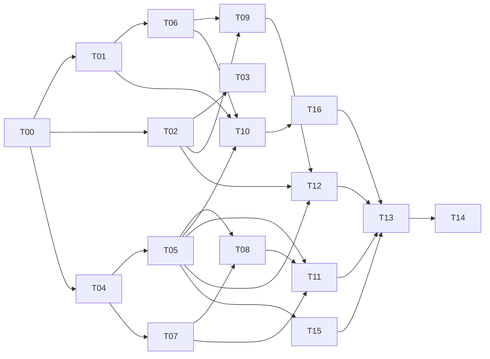

# Roadmap - build-0.1A

**Lead-only.** The Status column and the log below are edited by the lead session
and nobody else. Protocol: [PROTOCOL.md](PROTOCOL.md). Settled calls:
[DECISIONS.md](DECISIONS.md).

| | |
|---|---|
| Started | 2026-10-04 |
| Freeze | **not set** - user input |
| Go/no-go | after T13's QA Handoff |

---

## Dependency graph

---

## Tasks

Status: **Not started** · **In review** · **Merged** · **Cut**

| ID | Task | Wave | Lane | Status | On `main` |
|---|---|---|---|---|---|
| T00 | Harnesses parallel-safe and 3.8-safe | 0 | - | Merged | `7bfbb3a` |
| T01 | Only template files travel (git, not disk) | 1 | - | Merged | `0d8a02a` |
| T02 | Hooks find Python on any OS | 1 | - | Merged | `fdf06cf` |
| T04 | Card templates require citations | 1 | - | Merged | `70e8839` |
| T03 | usage.py finds transcripts on any path | 2 | - | Merged | `92337a7` |
| T05 | check.py enforces card contracts | 2 | - | Merged | `f214843` |
| T06 | Second-gen adopt; build label in manifest | 2 | - | Merged | `c86f435` |
| T07 | Interview before writing a card | 2 | - | Merged | `befa2f5` |
| T08 | AGENTS.md: a card is a map | 3 | - | Merged | `332eb65` |
| T09 | Docs drift; derived build label | 3 | - | Merged | `684ac0b` |
| T10 | Detect missed test commands | 3 | - | Merged | `183474c` |
| T15 | Skip-list check asks git | 3 | - | Merged | `2cf05ce` |
| T11 | ADR 0004: cards grow from tasks | 4 | Workflow | Not started | |
| T12 | scan.py false positive; scan suite | 4 | Scan | Not started | |
| T16 | docs/plan stays home; null scripts keep install | 4 | Adoption | Not started | |
| T13 | QA end to end | 5 | QA | Not started | |
| T14 | Release prep | 6 | Release | Not started | |

Lanes are defined in [PROTOCOL.md](PROTOCOL.md) from wave 4, when this standard
was adopted. Waves 0-3 ran on per-task file lists.

---

## Go/no-go checkpoint

After T13 reports. **Go** only if all of these hold:

- `check.py` and all four suites green on `main`;
- T13's JLGC adopt -> undo round trip is byte-identical;
- the card T13 writes through the interview passes `check.py`;
- no open security finding;
- every known issue below has been read and accepted.

## Cut line

**Must ship:** T11, T13, T14, T16.
**May be cut to hold a date:** T12 - it removes false positives, it does not catch
a missed secret.
Security fixes are never cut to hold a date.

---

## User inputs needed

- [ ] Freeze date.
- [ ] Go-ahead for the `build-0.1A` tag after T14 (the lead tags `main`).
- [ ] Rollout testers covering **one Mac** and **one Java/Maven repo**.
- [ ] The original tester re-runs review tasks 1 and 4 (D-12).
- [ ] Rename the directory with no session open:
      `mv "~/Desktop/Legacy Modernization" "~/Desktop/Ground Work"`.
- [ ] Archive the finished task sessions in the app - their 12 empty worktree
      folders under `.claude/worktrees/` stay locked until you do.
- [ ] Optional: Settings -> Claude Code -> worktree location, if you want
      worktrees at `../<repo>-Txx` rather than inside the repo (D-07).

---

## Known issues

Accepted for 0.1A; each is a candidate brief for the next release.

| Issue | Found by |
|---|---|
| No `--update` path for adopted projects (the manifest now records the version) | ADR 0003 |
| `.ps1` adapters invoke `powershell`; macOS needs `pwsh` | sweep |
| `PROJECTS_DIR` ignores `CLAUDE_CONFIG_DIR` | sweep |
| Nested `.csproj` not detected | sweep |
| Adopted `settings.json` allows `python tests/invariants.py`, which never travels; allow-list uses `python`, not `python3` | sweep, T02 |
| Windows: no `python` but the Store `python3` stub on PATH -> hooks run the stub and fail visibly, without blocking | T02 |
| `./mvnw` / `./gradlew` do not run in cmd or PowerShell (`mvnw.cmd`, `gradlew.bat`) - matters for the Java estate on Windows | T10 |
| Cards are not promoted automatically from `usage.py` re-read counts | ADR 0004 |
| ADR 0003's weight claim contradicted by 0.64x / 0.91x / ~1x measured | trials |
| `surveyor.md`'s grep-first rule has no diagnosis exception (it surveys, it does not diagnose) | T08 |
| `check.py` keeps a redundant inner `date` import | T15 |
| Harness output columns overflow on long case names | T03, T10 |
| `project_dirs_for` fallback globs unsorted | T03 |
| The harness's Python < 3.12 branch is unexercised - no older Python here | T00 |
| Gap tests (D-11) | standard |
| README gives only the GitLab clone URL; GitHub is the route in from outside the company network - lead doc fix once T16 (which owns README this wave) merges | D-14 |

---

## Status log

Newest first. Lead only.

**2026-10-04**

- **Remotes reconciled (D-14).** Removed `origin`'s `pushurl` override, so
  `origin` is GitLab both ways. Pushed `main` (`97e016c`) to GitLab and GitHub;
  both match `main`, and `origin/main` is current, so new worktrees start current.
- **Pushed `main` (`91efe57`) - to GitHub only.** `origin` is split: it fetches
  from the internal GitLab (`gitlab.optimizasolutions.com/myaghmour/ground-works`)
  and pushes to GitHub (`JaGaiMO0O/Ground-Work`). GitLab - the clone URL the README
  gives testers, and the side `origin/main` tracks - is still at `1a79a04`. That is
  the real reason worktrees start stale; D-13's premise does not hold until the
  remotes are reconciled. User decision pending.
- **Migrated to `docs/plan/`** (D-09): briefs moved from `context/tasks/`, their
  `Status:` lines removed (this table is canonical), open briefs gained Lane,
  Estimate and a Handoff with Rollback. PROTOCOL rewritten to the user's
  standard; contracts kept verbatim. DECISIONS D-01 to D-13 record the calls made
  so far. **T16 added**: the move itself made `docs/plan/` travel into adopted
  projects, and T10's brief caused a `"scripts": null` regression.
- **Lead fixes** (`e47827f`, and the migration commit): legacy-profile pointers to
  the profile's own stacks doc; `_lib.py` comment; `check.py` comment now points at
  the template, which travels; STATUS Now line points here.
- **Wave 3 merged** `--no-ff` after the user's review: T08, T09, T10, T15.
  Verified first on a throwaway integration worktree: check 0, invariants 51/51,
  hooks 26/26, adopt 31/31. Branches deleted; worktree registrations removed; 12
  empty folders remain, locked by the finished sessions.
- **Wave 2 merged** (T03 fast-forward; T05, T06, T07 cherry-picked). Gate 49/49,
  26/26, 26/26 with eight worktrees live. Found: the app starts worktrees from
  `origin/main`, not local `main` - sessions now fast-forward first. T15 added.
- **Wave 1 merged** (T01 fast-forward; T02, T04 cherry-picked). Gate 39/39, 23/23,
  23/23 with five worktrees live - T01's fix proven. C1/C2 rulings.
- **Wave 0**: T00 merged. Gate adopt 21/22 - a live worktree was copied into every
  adopted project. T01 rewritten to take the template's file list from git.
- Plan approved; briefs T00-T14 written.
